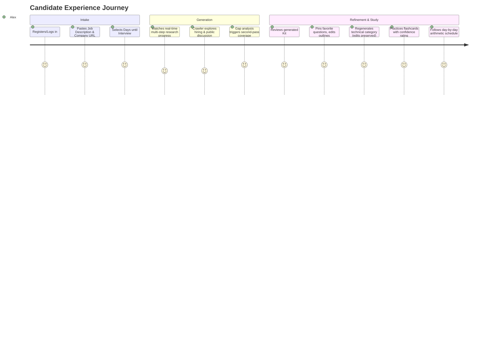

# Product Requirements Document (PRD)
## Project: The AI Interview Prep Kit
**Document ID:** TRAO-PRD-FS-AI-INTERVIEW-01  
**Assessment Target:** Trao Full-Stack Engineering Assessment  

---

## 1. Executive Summary
The **AI Interview Prep Kit** is an end-to-end intelligent interview readiness platform. Rather than relying on generic, one-size-fits-all prep questions or single-prompt LLM generation, the application ingests a job description, autonomously investigates the prospective company across public and web sources, and orchestrates a deliberate multi-step pipeline.

The result is a tailored, structured, and editable preparation kit comprising:
- An honest **Company Brief** and hiring culture summary.
- A granular **Role & Requirement Breakdown** (differentiating `must` vs `nice` requirements).
- A **Categorized Question Bank** strictly mapped to validated requirements.
- **Interactive Flashcards** for active recall.
- A **Deterministic Day-by-Day Study Schedule** distributing topics proportionally across available preparation days.
- **The Builder**: A state-resilient editing surface where users can modify, reorder, and selectively regenerate sections without destroying manual edits.
- **Practice Mode**: An active recall environment with confidence tracking and spaced repetition.

---

## 2. Problem Statement & User Value
Job seekers face significant challenges when preparing for modern engineering interviews:
1. **Generic Preparation**: Standard interview questions rarely reflect the specific hiring philosophy, tech stack nuances, or actual interview stages of the employer.
2. **Scattered Information**: Digging through handbooks, blogs, and public forums to understand how a company interviews takes hours of manual research.
3. **Time Constraint Panic**: Candidates often have limited time (e.g., 3 to 14 days) and struggle to prioritize high-leverage topics without burning out.
4. **Fragile AI Generation**: Typical AI tools produce superficial, unverified summaries that fail to capture implicit hiring rubrics and invent nonexistent requirements.

**Value Proposition:** Trao AI Interview Prep Kit provides structured, verified, customizable preparation with mathematical rigor behind study allocation and strict coverage guarantees.

---

## 3. User Personas & Core Journeys

### User Personas
- **Alex (Active Candidate)**: Has an interview in 4 days at a high-growth tech startup. Pastes JD and company website URL, needs an immediate, actionable study plan focused on core must-haves.
- **Priya (Multi-track Job Seeker)**: Uploads multiple JD/company pairs to compare requirements and batch-generate targeted preparation kits.
- **Automated Evaluator (Trao Grading Suite)**: Executes batch evaluation via `npm run evaluate` across unseen test cases to verify pipeline resilience, schema fidelity, and algorithmic accuracy.

### Core User Journey


---

## 4. Detailed Feature Specifications

### 4.1 Authentication & Multi-Tenancy
- **Registration & Authentication**: Email/password authentication with JWT or secure session cookies.
- **Data Isolation**: Strict tenancy enforcement; users can access and modify only their own kits.
- **Session Handling**: Seamless renewal and graceful expiration handling without data loss in progress.
- **Scope Note**: Intentionally minimal per assessment specification (no email verification, password reset, or OAuth hierarchies).

### 4.2 Job Intake & Batch Ingestion
- **Single Intake Interface**:
  - Textarea for raw Job Description text (no scraping of blocked job boards).
  - Input field for target Company Website URL (with protocol normalization).
  - Numerical input/slider for Days until interview (bounded 1 to 60 days).
- **Batch Upload**:
  - Ability to upload a JSON file containing multiple `{ jd, company_url, days }` cases.
  - Multi-case progress monitoring.

### 4.3 Research & Web Crawler Engine
- **Autonomous Link Discovery**:
  - Ingests base domain (e.g. `https://posthog.com`).
  - Fetches `robots.txt` and obeys disallow rules.
  - Heuristic scoring of discovered internal links to locate hiring, career, engineering blog, and handbook pages (e.g., `/careers`, `/jobs`, `/handbook`, `/values`, `/culture`, `/about`).
  - Extracts clean page text (removing navigation boilerplate, scripts, SVGs).
- **Public Discussion Retrieval**:
  - Probes search queries for public interview discourse (e.g., Glassdoor, Reddit, Blind mentions).
  - Skips gracefully on network failure or empty results without aborting the run.
- **SSRF & Security Safeguards**:
  - Disallows loopback (`127.0.0.1`, `::1`), private ranges (`10.0.0.0/8`, `172.16.0.0/12`, `192.168.0.0/16`), and AWS/GCP metadata IP endpoints (`169.254.169.254`) in production.
  - Allows local test addresses (e.g. `http://localhost:8099/...`) when running in local evaluation/development mode.
  - Enforces response size caps (max 2MB per page) and timeouts (5s per page).
  - Treats fetched web content as untrusted input (isolated from LLM system prompts).

### 4.4 Multi-Step Research & Generation Pipeline
The pipeline executes deliberate sequential steps:
1. **Extraction**: Identifies core requirements from the JD text.
   - Categorizes as `technical`, `behavioural`, or `domain`.
   - Classifies priority strictly as `must` vs `nice` based on JD syntax.
   - Assigns stable IDs (`r1`, `r2`, ...).
   - Zero hallucinations: never invents requirements absent from the JD.
2. **Company Synthesis**: Generates honest summary of what the company does and how they interview based strictly on gathered crawl pages.
3. **Category-Specific Question Generation**:
   - Technical requirements spawn technical & coding questions.
   - Mentorship/leadership spawn behavioural/STAR format questions.
   - System architecture requirements spawn system design questions.
   - Company interview findings tailor the tone and format (e.g., take-home vs. whiteboarding).
4. **Flashcard Generation**:
   - Generates high-yield active recall flashcard pairs linked to specific requirement IDs.
5. **Deterministic Gap Analysis & Coverage Check**:
   - Algorithmic evaluation: finds any `must` requirement ID lacking associated questions.
6. **The Second Pass (Feedback Loop)**:
   - Feeds identified coverage gaps back into targeted generator prompts.
   - Closes missing requirements up to configured max passes (default: 2 passes).
   - Documents final coverage status in `coverage: { uncovered_requirement_ids, passes }`.

### 4.5 The Builder (Interactive Reshaping & State Machine)
A prep kit must be customizable without fragile state loss.
- **Inline Editing**: Live editing of question prompts, answer outlines, flashcard text, and company brief.
- **Reordering & Categorization**: Drag-and-drop or click reordering; ability to move questions between categories (`technical`, `behavioural`, `system-design`, `company-fit`).
- **Manual Add/Delete**: Users can create custom questions or flashcards from scratch or delete unwanted ones.
- **Selective Section Regeneration**:
  - Regenerate single section (e.g., only `technical` questions or only `company_brief`).
  - **State Preservation Algorithm**: Questions flagged as `isEdited: true` or `isPinned: true` or `origin: 'user'` are strictly preserved during regeneration. Only untouched generated items are replaced.

### 4.6 The Schedule (Deterministic Arithmetic Allocation)
- **Zero Hallucination Allocation**: Computed via deterministic TypeScript algorithm, not by the LLM.
- **Guarantees**:
  - Exactly matches `days_available` requested by candidate.
  - Every `must` requirement is scheduled across the timeline.
  - Front-loads higher difficulty (difficulty 3) and must-have priorities earlier in the week.
  - Leaves review/light recap on final day before interview.
  - Durations are integer minutes (e.g., 45, 60, 90).

### 4.7 Practice Mode
- **Active Recall Interface**:
  - Clean card flip UI (front prompt $\to$ back answer outline / key criteria).
  - Keyboard shortcuts (Space to flip, 1-4 for confidence rating).
- **Confidence Tracking**:
  - Rates confidence on 3-tier or 4-tier scale (e.g., *Needs Review*, *Shaky*, *Confident*).
- **Adaptive Review Queue**:
  - Confidence-weighted review sorting: prioritizes low-confidence cards in subsequent practice cycles.

### 4.8 Batch Entry Point (`npm run evaluate`)
- Conforms to Section 9:
  ```bash
  npm run evaluate -- --input <cases.json> --output <kits.json>
  ```
- Processes test suites without requiring browser UI.
- Strict conformance to Appendix B JSON format.
- Gracefully captures failures under `{ status: "failed", error: { code, message } }` while completing all other cases.

### 4.9 Creative Feature: "Readiness Score & One-Click PDF/Markdown Brief"
- **Interview Readiness Diagnostic**:
  - Calculates a real-time readiness score (0-100%) based on must-have coverage, flashcard mastery percentage, and completed schedule sessions.
- **One-Click Printable Cheat Sheet**:
  - Generates a single-page condensed cheatsheet containing company talking points, must-have architecture questions, and behavioral stories ready for the interview morning.

---

## 5. Non-Functional Requirements
- **LLM Rate-Limit Resilience**: Dynamic queueing, token budgeting, exponential backoff with jitter to stay strictly within free-tier limits (e.g., 15 RPM).
- **Performance**: Batch runner processes 5 cases within 15 minutes.
- **Responsiveness**: Mobile and desktop friendly, responsive Tailwind CSS layouts, full keyboard navigation.
- **Testing**: Comprehensive automated test suite for deterministic components (scheduler arithmetic, coverage validator, schema compliance).
- **Deployment**: Zero-cost free-tier deployment (e.g. Vercel for Frontend, Render/Railway/Fly.io for Backend, MongoDB Atlas for DB).
