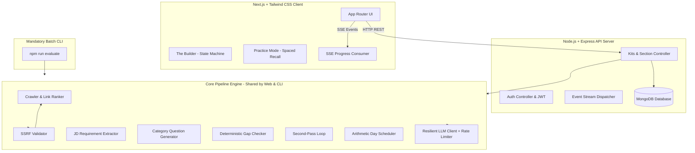
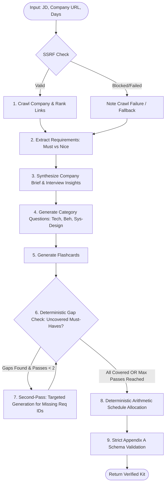

# System Architecture & Technical Design
## Project: Trao AI Interview Prep Kit
**Specification:** `FS-AI-INTERVIEW-01`

---

## 1. High-Level System Architecture



---

## 2. The Deliberate Multi-Step Pipeline

The assessment explicitly forbids a single monolithic prompt:
> *"The kit must be produced through a sequence of deliberate steps that respond to what has actually been found, not by a single prompt that returns everything at once."*



### Pipeline Step Breakdown

1. **Step 1: Security & Discovery (Crawler)**
   - Normalizes target domain.
   - Evaluates against SSRF rules (rejects private/loopback IPs in production; allows localhost in test mode).
   - Ingests `robots.txt` to respect crawl directives.
   - Discovers internal links and scores them:
     - Keywords matching `careers`, `jobs`, `hiring`, `interview`, `culture`, `handbook`, `engineering` get top priority.
   - Limits fetch to top 3 highest-ranked relevant pages to conserve bandwidth and prevent crawling bloat.
2. **Step 2: JD Requirement Extraction**
   - Inputs raw JD text.
   - Extracts structured requirements: `title`, `seniority`, `responsibilities`, and atomic `requirements` array.
   - Strict `priority` labeling:
     - `must`: Explicit requirements (*"must have"*, *"5+ years"*, *"required"*, core responsibilities).
     - `nice`: Differentiators (*"bonus points"*, *"preferred"*, *"nice to have"*, *"familiarity with"*).
   - Strict `kind` labeling: `technical`, `behavioural`, or `domain`.
   - Assigns immutable identifiers: `r1`, `r2`, `r3`...
   - **Stub Protection**: If given a 2-line stub, outputs only stated facts, zero hallucinations.
3. **Step 3: Company Brief Synthesis**
   - Uses actual extracted page text. If no hiring page is discovered, records what is known and notes lack of public hiring data.
4. **Step 4: Category-Specific Question Generation**
   - Dispatches focused prompts per category rather than a kitchen-sink request:
     - `technical`: Algorithm, framework internals, code patterns mapped to tech `r_ids`.
     - `system-design`: Architecture, scalability, state handling mapped to senior tech/domain `r_ids`.
     - `behavioural`: Mentorship, conflict resolution, ownership mapped to behavioural `r_ids`.
     - `company-fit`: Specific questions testing alignment with company values retrieved from crawled pages.
5. **Step 5: Flashcard Generation**
   - Produces active recall pairs with bite-sized concepts mapped directly to requirement IDs.

---

## 3. Deterministic vs. Model Boundaries (Critical Architectural Rule)

The assessment explicitly reserves two operations for deterministic code rather than LLM prompts:

### Boundary 1: Coverage Gap Analysis (Pure TypeScript)
```typescript
export function computeCoverageGaps(
  requirements: Requirement[],
  questions: Question[]
): string[] {
  // Extract all MUST requirement IDs
  const mustReqIds = new Set(
    requirements.filter((r) => r.priority === "must").map((r) => r.id)
  );

  // Extract all requirement IDs covered by at least one question
  const coveredReqIds = new Set<string>();
  for (const q of questions) {
    for (const reqId of q.requirement_ids) {
      coveredReqIds.add(reqId);
    }
  }

  // Gaps are must-have requirements with zero questions
  const gaps: string[] = [];
  for (const reqId of mustReqIds) {
    if (!coveredReqIds.has(reqId)) {
      gaps.push(reqId);
    }
  }

  return gaps;
}
```

### Boundary 2: Arithmetic Day Allocation (Pure TypeScript)
```typescript
export function allocateSchedule(
  questions: Question[],
  requirements: Requirement[],
  daysAvailable: number
): Schedule {
  // 1. Sort questions by importance:
  //    - Linked to 'must' requirement first
  //    - Higher difficulty (difficulty 3 -> 2 -> 1)
  // 2. Distribute questions across exactly `daysAvailable` days:
  //    - Harder / higher priority placed in earlier days (Day 1..N-1)
  //    - Final day dedicated to recap / company-fit / behavioural
  // 3. Calculate integer minutes based on question count & difficulty:
  //    - Each question assigned base duration: diff 1 (15m), diff 2 (25m), diff 3 (40m)
  // 4. Return valid Appendix A schedule shape.
}
```

---

## 4. The Builder State Machine (Solving the Regeneration Problem)

The brief notes:
> *"Regenerating one section must not discard edits the user has made elsewhere, and a question the user wrote or edited by hand must survive a regeneration of its category... This is the hardest state problem in the assessment and we will look closely at how you solved it."*

### State Architecture
Every item in the kit contains metadata flags:
```typescript
interface StatefulItem {
  id: string;
  isEdited: boolean;   // Set true when user modifies prompt or answer inline
  isPinned: boolean;   // Set true when user explicitly locks/pins the item
  origin: "generated" | "user"; // "user" if added manually, "generated" if created by AI
}
```

### Regeneration Merge Algorithm
When the user clicks **"Regenerate Technical Questions"**:
```typescript
export function mergeRegeneratedCategory(
  existingQuestions: Question[],
  incomingQuestions: Question[],
  targetCategory: string
): Question[] {
  // 1. Partition existing questions in targetCategory into:
  //    - Protected (isPinned === true || isEdited === true || origin === 'user')
  //    - Replaceable (isPinned !== true && isEdited !== true && origin === 'generated')
  const protectedItems = existingQuestions.filter(
    (q) => q.category === targetCategory && (q.isPinned || q.isEdited || q.origin === "user")
  );

  // 2. Filter out untouched old items from that category, keep all other categories untouched
  const otherCategories = existingQuestions.filter((q) => q.category !== targetCategory);

  // 3. Deduplicate incoming questions against protected items
  const newAdditions = incomingQuestions.filter(
    (inc) => !protectedItems.some((prot) => prot.prompt.trim().toLowerCase() === inc.prompt.trim().toLowerCase())
  );

  // 4. Combine: Other categories + Protected items + Fresh generated additions
  return [...otherCategories, ...protectedItems, ...newAdditions];
}
```

---

## 5. Resilience & Rate-Limit Strategy

Free tier LLM models (e.g. Gemini 1.5/2.0 Flash or Groq Llama 3) feature strict Rate Limits:
- **15 Requests Per Minute (RPM)**
- **Tokens Per Minute (TPM) Limits**

### Implementation Strategy
1. **Sliding-Window Throttler**: Delays calls to guarantee $\le 12$ RPM (20% safety margin).
2. **Jittered Exponential Backoff**: When an HTTP `429` is received:
   $$\text{delay} = \min(2^{\text{retryCount}} \times 1500\text{ms} + \text{random}(0, 500\text{ms}), 30000\text{ms})$$
3. **Structured Output Enforcement**: Uses JSON schema mode (`response_mime_type: "application/json"`) to ensure strict Appendix A compatibility.
4. **Fallback Heuristic Parser**: If an unexpected trailing character or markdown codeblock wrapper is returned, a cleanup pipeline extracts valid JSON via balanced bracket matching.
