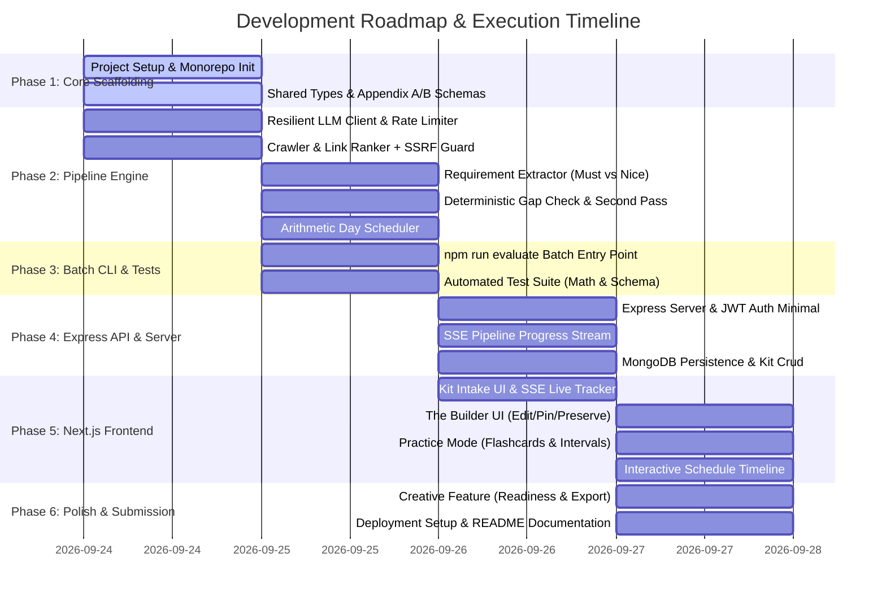

# Engineering Roadmap & Implementation Plan

## Project: Trao AI Interview Prep Kit

**Specification:** `FS-AI-INTERVIEW-01`

---

## 1. Project Phases Overview

---

## 2. Milestone Breakdown & Deliverables

### Phase 1: Project Setup & Shared Contracts

- [X] Git repository initialization & `.gitignore`.
- [X] Product Documentation (`PRD.md`, `requirements.md`, `api.md`, `architecture.md`, `roadmap.md`).
- [ ] Root `package.json` with npm workspaces (`server`, `client`, `shared`).
- [ ] Shared TypeScript interfaces and runtime Zod validation schemas for Appendix A and Appendix B.

### Phase 2: Core AI & Deterministic Pipeline Engine

- [ ] **Resilient LLM Client (`server/src/pipeline/llm.ts`)**:
  - Multi-provider support (Gemini API / Groq / OpenAI compatible).
  - Rate-limit token bucket & exponential backoff with jitter for free tiers.
  - Strict JSON schema enforcement and JSON repair heuristics.
- [ ] **Web Crawler & SSRF Guard (`server/src/pipeline/crawler.ts`)**:
  - Loopback/private IP blocking in production; support for test local fixtures.
  - Robots.txt parser and HTTP link heuristic scoring (`/careers`, `/jobs`, `/handbook`, `/engineering`).
  - HTML text sanitization and size caps (2MB).
- [ ] **Requirement Extractor (`server/src/pipeline/extractor.ts`)**:
  - Differentiates `must` vs `nice` requirements strictly based on JD wording.
  - Categorizes as `technical`, `behavioural`, or `domain`.
  - Assigns stable IDs (`r1`, `r2`, ...).
  - Edge case: Two-line stub produces minimal, honest output with zero hallucinations.
- [ ] **Category-Specific Question & Flashcard Generator (`server/src/pipeline/generator.ts`)**:
  - Generates distinct questions for each category mapped to requirement IDs.
  - Generates flashcards with front/back recall pairs.
- [ ] **Deterministic Gap Check & Second-Pass Loop (`server/src/pipeline/coverage.ts`)**:
  - Pure mathematical set difference of covered `must` requirements.
  - Targeted second-pass prompts to cover any uncovered must-haves.
- [ ] **Arithmetic Day-by-Day Scheduler (`server/src/pipeline/scheduler.ts`)**:
  - Zero-model arithmetic allocation across exact requested `days_available`.
  - Front-loads high difficulty and must-haves earlier in the schedule.
  - Enforces integer minutes for every day.

### Phase 3: Mandatory Batch Entry Point & Automated Tests

- [ ] Implement `npm run evaluate -- --input <cases.json> --output <kits.json>`:
  - Consumes array of test cases from CLI arguments.
  - Invokes the identical core pipeline used by web application.
  - Graceful per-case error handling (`status: "failed"`).
  - Conforms strictly to Appendix B JSON format.
- [ ] Comprehensive Automated Tests:
  - Unit tests for arithmetic schedule distribution.
  - Unit tests for coverage gap checking and second-pass logic.
  - Unit tests for SSRF guard and URL safety.
  - Appendix A schema validation tests.

### Phase 4: Express API & Real-Time Server

- [ ] Express application bootstrap with TypeScript.
- [ ] Minimal session/JWT authentication (scoped user access).
- [ ] Server-Sent Events (SSE) progress broadcasting for web generation.
- [ ] MongoDB kit persistence with Mongoose.
- [ ] State-preserving section regeneration endpoint (`POST /api/kits/:id/regenerate-section`).

### Phase 5: Next.js Modern Frontend

- [ ] Next.js App Router + Tailwind CSS setup.
- [ ] Intake page: Textarea for JD, URL input, slider for days, multi-role JSON upload.
- [ ] Live generation progress screen with step indicators and failure recovery.
- [ ] **The Builder**:
  - Inline editing of question text, outlines, and cards.
  - Drag/click reordering and moving between categories.
  - Pinned item toggle and manual question additions.
  - Single-section regeneration without clobbering user edits.
- [ ] **Practice Mode**:
  - Interactive flashcard flip deck.
  - Confidence scoring (1 to 5) and adaptive spaced repetition queue.
- [ ] **Schedule View**:
  - Visual interactive day-by-day study roadmap.

### Phase 6: Creative Feature & Submission Finalization

- [ ] **Creative Feature**:
  - **Interview Readiness Diagnostic**: Live score calculation based on card ratings and schedule progress.
  - **One-Click Printable Cheat Sheet**: Single-page printable review export.
- [ ] Environment documentation in `.env.example`.
- [ ] Comprehensive `README.md` addressing every evaluation question in the Trao brief.
- [ ] Deployment configuration (Vercel + Render / Railway).
